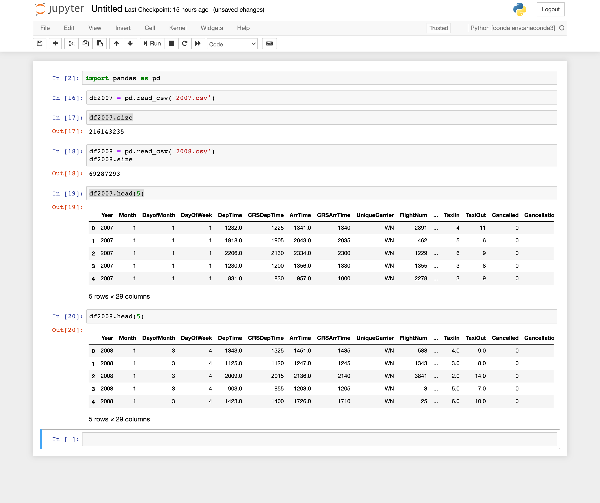

## DEND Capstone Project - Airline on-time performance
Capstone project for Udacity Data Engineering Nanodegree course

### Objective:
The objective of this project is to create a data model and ETL flow for airline flight on-time performance. The data comes from the Statistical Computing open data website (http://stat-computing.org/dataexpo/2009/). The data collectef is between 2007 and 2008 that contain more than 200 Milion records. In this project we will used flight airline records with supplementary like IATA airport data and airlines data.

### Datasource Details:
The data is gathered from Statistical Computing. Following datasets are in scope of this project:
- 2007.csv (source:https://dataverse.harvard.edu/dataset.xhtml?persistentId=doi:10.7910/DVN/HG7NV7 )
- 2008.csv (source:https://dataverse.harvard.edu/dataset.xhtml?persistentId=doi:10.7910/DVN/HG7NV7 )
- airports.csv (source:https://dataverse.harvard.edu/dataset.xhtml?persistentId=doi:10.7910/DVN/HG7NV7 )
- carriers.csv (source:https://dataverse.harvard.edu/dataset.xhtml?persistentId=doi:10.7910/DVN/HG7NV7 )
- uscities.csv (source:https://simplemaps.com/data/us-cities )
- weather.csv  (source:http://berkeleyearth.org/archive/data/)
Here are some snippets of the datasets:

Flights traffic

Airports

Airlines

Dimographics data

### Project Scope:
In this project, we create a data pipeline that will take source files from s3 buckets, process and clean them, transform (Data Wrangling) to deliver the data to the final data model, and load them into dimension and fact tables. We're going to read the source files from local memory, use airflow and Python to create a data pipeline, and ultimately load the processed and transformed data into a data model created in a local PostgreSQL database.

### Technology used:
- Apache Airflow
- Python
- PostgreSQL

### Data Model
The final data model consists of 12 dimension and 3 fact tables. Following is the data model diagram:

### Data Pipeline Design
The data pipeline was designed using Apache Airflow. The whole process was segregated in several phases:
- create redshift cluster using python bash file
- Creating staging tables
- transfer data from s3 into stageing tables
- create fact and dimension tables
- Loading the dimension tables
- Loading the facts tables 
- Performing data quality checks

Following is the airflow dag for the whole process:

### Addressing Other Scenarios

#### The data was increased by 100x.

as long we used the redshift with airflow tools is more than easier than using spark or other ETL tools so this will be not a problem.

#### The pipelines would be run on a daily basis by 7 am every day.

we can schedule this using airflow is make an easy and great choice that is possible with airflow tools.
#### The database needed to be accessed by 100+ people.

as long we using AWS redshift cluster server that can be handled with is good choice vs local server
